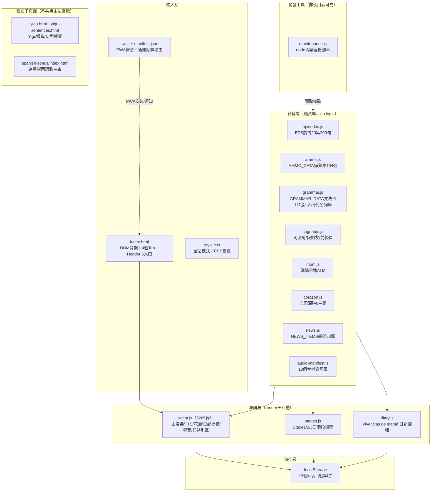

# 🗺️ 產品軌道 — 功能盤點與系統地圖
### Product Track — Feature Inventory & System Map

> 這份文件是**盤點**，不是待辦清單。目的是回答三個問題：
> ①現在系統裡實際有什麼？②每個東西的定位是什麼（核心／輔助／未來）？③文件講的跟程式碼跑的，哪裡對不上？
> **本輪只讀不寫**：沒有修改任何 `.js`/`.html`/`.css` 檔案，所有數字都是直接讀程式碼/資料檔算出來的，不是照抄 `CLAUDE.md` 的自述文字。

- 盤點對象：`verachivo/mi-casa-de-chunks`（純 Vanilla JS，零框架，零後端）
- 盤點方法：讀 `index.html` 結構＋逐一計算各資料檔陣列筆數＋比對 `CLAUDE.md`/`ROADMAP.md` 的自述數字
- 前置文件：`PRODUCT_PRINCIPLES.md`／`PRD.md`／`MVP_BOUNDARY.md`（Track 1 產出，**不在本 repo 內**，本文件不重複其內容，只在分類判斷時引用其精神）
- 相關既有文件：`CLAUDE.md`（開發交接總帳，含完整歷史）／`ROADMAP.md`（高層進度）／`CONTENT_RULES.md`（內容治理規則）／`ACCEPTANCE_CHECKLIST.md`（工程驗收表）——本文件不取代這些，是額外補上「當下系統長什麼樣」的橫切面視角

---

## 1. 系統地圖（檔案分層架構）

**分層原則（從程式碼結構反推，非新設計）**：資料檔（8個 `*.js`）只存陣列/物件，不含渲染邏輯；`script.js` 是唯一的「上帝檔案」，包辦渲染、狀態、TTS、花園、任務引擎；`stages.js`／`diary.js` 是兩個切出來的子邏輯（各自獨立 localStorage 讀寫，但仍依賴 `script.js` 的全域函數如 `getGardenDB()`）；`maintenance.js` 是唯一的自動化品管腳本（`npm run check`），不影響使用者體驗。

---

## 2. Header 6 入口 × 4 大分頁 對照

| Header入口 | 呼叫函數 | 導向內容 |
|---|---|---|
| 🧭探索路線 | `openLevelNavDirect()` | `GRAMMAR_LEVEL_TIERS`等級篩選（a1a2/b1/b2c1/c1） |
| 🗺️莊園導覽 | `showWorldTour()` | `WELCOME_TOUR_STEPS` 5步導覽（可重播） |
| 🎁入園巧遇 | `entryMatrixJump('daily')` | `ENTRY_MATRIX_ITEMS` 6格矩陣（見第3.9節，1格disabled） |
| 🌿（動態，`#headerStartSlot`） | `renderHeaderStartSlot()` | 新手看🌱點播初芽／有進度看🌿我的成長 |
| 🧰莊園工具 | `openWorkshopPanel()` | `WORKSHOP_TOOLS`：6個外部查詢連結（Forvo/YouGlish/WordReference/CapCut/Ondoku/Luvvoice） |
| 🌎拉美巡禮 | `openWorldEntryPanel()` | 📰世界新聞／🗣️街頭母語／🎭文化深度 三分類 |

| 主分頁 | 內部 id | 定位 |
|---|---|---|
| 🌾田間播語塊 | `tabPlay` | 主線學習（劇情→彈藥→三階段練習） |
| ☀️日光育苗場 | `tabKnow` | 參考工具（文法/同源/變位/人物冊/歌詞/拉美巡禮） |
| 🛌床邊低語呢 | `tabMom` | 成人自我對話語塊（媽媽語塊ATM＋心田深耕） |
| 🗃️穀倉大豐收 | `tabPrivate` | 個人資產（收藏/花園/日記/備份/致謝牆） |

---

## 3. Feature Inventory（依 4 分頁＋跨頁功能分組）

**分類標準**（依程式碼可觀察的事實判斷，非猜測）：
- **Core**：使用者主線學習迴路必經之路，或多個其他功能依賴它的資料（拿掉會斷鏈）
- **Supporting**：獨立可用的輔助/參考工具，拿掉不影響主線學習，但有實際使用價值
- **Future**：程式碼裡已有骨架但功能是 `disabled`／佔位／內容覆蓋率明顯不完整（例如只做2個詞而非通用）

### 3.1 🌾田間播語塊（主線學習）

| # | 功能 | 分類 | 負責檔案／函數 | 資料規模（實測） |
|---|---|---|---|---|
| 1 | 劇情主線 Episodes | **Core** | `episodes.js`（`EPS`）／`script.js` render | 20集，每集10句＝200句固定跨距 |
| 2 | 新手第一站路線 `NEWCOMER_ROADMAP` | **Core** | `script.js`（`selectEp`/`jumpToStoryStart`）、依賴`EPISODE_COMPLETION_MARKERS` | E17-E20共4集40句 |
| 3 | 語塊採集籃（彈藥庫） | **Core** | `ammo.js`（`AMMO_DATA`）＋`SENTENCE_AMMO_MAP2` | 104張（E1-E10共100張＋E17共4張） |
| 4 | 造句挑戰（自由輸入核對句型） | **Core** | `script.js`（`checkMakeFree`/`getMakePattern`） | 依`expand`資料逐句提供 |
| 5 | 三階段修煉關卡 Stage1/2/3 | **Core** | `stages.js` | Stage1排序／Stage2動詞卡／Stage3固定選字造句 |
| 6 | 英西同源槓桿（逐句摺疊寶箱） | Supporting | `cognates.js`（`SENTENCE_COGNATES`）／`buildCogDetails()` | 逐句對應，非全覆蓋 |
| 7 | 雙音軌錄放對比（🐝導師 vs 🎙️自己錄音） | Supporting | `script.js`（MediaRecorder） | 僅掛在彈藥庫底部，非每句都有 |

### 3.2 ☀️日光育苗場（參考工具庫）

| # | 功能 | 分類 | 負責檔案／函數 | 資料規模 |
|---|---|---|---|---|
| 8 | 🍄🫐同源詞庫／前後綴／假朋友 | Supporting | `cognates.js`（`COGNATE_LIBRARY`/`SUFFIX_PATTERNS`/`FALSE_COGNATES`） | 同源49筆／假朋友24筆 |
| 9 | ⚧太極定裝鏡（陰陽字尾） | Supporting | `cognates.js`（`GENDER_PAIRS`） | 純字尾規律示範 |
| 10 | 🏰莊園人物冊（人稱代名詞） | Supporting | `grammar.js`（`PRONOUN_LIBRARY`/`PRONOUN_COMBO_RULES`） | 4類角色＋組合規則 |
| 11 | 🎵歌詞填空 | Supporting | `script.js`（`LYRICS_FILL_DATA`） | 25句／21首歌 |
| 12 | 💧文法儲水槽（含⭐必學核心快速入口＋等級/主題篩選） | **Core** | `grammar.js`（`GRAMMAR_DATA`/`GRAMMAR_LEVEL_TIERS`/`CORE_ESSENTIALS`） | 117張全卡，篩選後主池59張（見第5節落差①） |
| 13 | 🔄超級變變變（動詞變位庫，儲水槽內巢狀子區塊） | Supporting | `grammar.js`（`g.conj`/`conj_subj`/`conj_cond`）／`script.js` renderConjLibrary | 依卡片`conj`欄位動態產生 |
| 14 | 🌎拉美巡禮：📰世界新聞 | Supporting | `news.js`（`NEWS_ITEMS`） | 53篇，皆附真實查證來源 |
| 15 | 🌎拉美巡禮：🗣️街頭母語 | Supporting | `grammar.js`（`WORLD_ZONE_MAP.slang`） | 26張（從117張文法卡分流） |
| 16 | 🌎拉美巡禮：🎭文化深度 | Supporting | `grammar.js`（`WORLD_ZONE_MAP.culture`） | 32張（含13張C1/C2文化卡，查證狀態見第5節落差④） |
| 17 | 🪞陳述式↔虛擬式對照（掛在g27內） | Supporting | `grammar.js`（`INDIC_SUBJ_PAIRS`） | 靜態並排，非獨立入口 |

### 3.3 🛌床邊低語呢（成人自我對話）

| # | 功能 | 分類 | 負責檔案／函數 | 資料規模 |
|---|---|---|---|---|
| 18 | 媽媽語塊ATM（4個子分類） | **Core** | `mom.js`（`MOM_ATM_DATA`） | sel_phrases/mom_daily/mom_small_moods/cat_says 4類 |
| 19 | 💬心田深耕（5大人生主題） | Supporting | `corazon.js`（`CORAZON_DATA`） | sentimientos/limites/crianza/cuidadora/crecimiento/solidaridad 共6主題 |

### 3.4 🗃️穀倉大豐收（個人資產／迴圈維持）

| # | 功能 | 分類 | 負責檔案／函數 | localStorage key |
|---|---|---|---|---|
| 20 | 🌱今日耕耘任務（時間×能量引擎） | **Core** | `script.js`（`renderDailyTask`/`dtaskPickTier`） | `peppa_daily_task_v1` |
| 21 | 🌻花園近況（新鮮度，純視覺） | Supporting | `script.js`（`renderGardenFreshness`） | `peppa_garden_watered_v1` |
| 22 | 🍯醞釀私語窖（收藏） | **Core** | `script.js`（`vocabList`） | `peppa_es_vocab_v1` |
| 23 | 🌻語塊花園（熟練度＋抓蟲複習） | **Core** | `script.js`（`getGardenDB`/`generateBattleQuestionPool`） | `peppa_garden_v1` |
| 24 | 🌳語塊家族（TENER/HACER關聯圖） | **Future** | `script.js`（`CHUNK_FAMILIES`） | 只有2個動詞家族／17分支，非通用框架 |
| 25 | 🧳資料保險箱（備份/還原） | Supporting | `script.js`（`exportBackup`/`importBackupFile`） | `BACKUP_KEYS`（14個，實際存在19個key，見第5節落差②） |
| 26 | 🐝蜂巢築巢觀測儀（致謝牆/贊助） | **Future** | index.html靜態區塊＋`changelogBody` | 純展示，無金流串接（見CLAUDE.md「付費機制構想」仍是草案） |
| 27 | 📔日記系統：Vivencias de mamá | **Core** | `diary.js` | `peppa_mom_diary_v1`／`peppa_mom_notes_v1` |
| 28 | 📔日記系統：聊療吾心語 | **Core** | `diary.js`（talk系列函數） | `peppa_talk_diary_v1` |

### 3.5 跨分頁 / 系統層功能

| # | 功能 | 分類 | 負責檔案／函數 |
|---|---|---|---|
| 29 | 🗺️歡迎導覽（首訪自動彈出＋可重播） | Supporting | `script.js`（`WELCOME_TOUR_STEPS`/`showWelcomeTour`） |
| 30 | 🌅農間小報（回訪者每日彈窗＋里程碑慶祝） | Supporting | `script.js`（`showMorningBrief`/`CHUNK_MILESTONES`） |
| 31 | 🔔每日提醒通知（PWA Notification） | Supporting | `script.js`（`checkReminders`）＋`sw.js`／`manifest.json` |
| 32 | 🔊音檔播放引擎（真人優先＋TTS fallback） | **Core**（基礎設施） | `audio-manifest.js`（10個manifest）＋`script.js`（`speak*Smart`系列） |
| 33 | `maintenance.js` 內容健檢腳本 | Supporting（開發工具） | `maintenance.js`（`npm run check`），10類檢查（重複ID/必填欄位/翻譯品質/術語殘留/孤兒/死入口等） |
| 34 | 🎁入園巧遇 6格矩陣中的「🎲驚喜包」 | **Future（已標記disabled）** | `script.js`（`ENTRY_MATRIX_ITEMS`，`target:'surprise', disabled:true`） |

### 3.6 獨立子專案（不算主站功能，僅盤點存在）

| # | 內容 | 狀態 |
|---|---|---|
| 35 | `yigu.html` / `yigu-sentences.html` | Yigú構音/句型練習，獨立頁面，不共用主站切換邏輯，內容仍是治療師教材到位前的過渡佔位 |
| 36 | `spanish-songs/index.html` | 「追星學西語」歌曲庫子專案，CLAUDE.md提醒歌詞版權需另外處理，與主站分開 |

**合計 34 個站內功能區塊＋2 個獨立子頁面 = 36 項**，符合「20+功能區塊」的盤點要求。

---

## 4. 資料儲存盤點（localStorage）

實測 `grep localStorage.(getItem|setItem)` 全站共 **19 個 key**，`BACKUP_KEYS`（備份/還原清單）只涵蓋 **14 個**：

| Key | 用途 | 在`BACKUP_KEYS`內？ |
|---|---|---|
| `peppa_es_v4` | 主學習進度（星星/彈藥解鎖） | ✅ |
| `peppa_es_vocab_v1` | 醞釀私語窖收藏 | ✅ |
| `peppa_es_grammar_v1` | 文法酷庫用戶造句 | ✅ |
| `peppa_es_familiarity_v1` | 熟悉度系統 | ✅ |
| `peppa_garden_v1` | 語塊花園熟練度 | ✅ |
| `peppa_garden_watered_v1` | 花園新鮮度時間戳 | ✅ |
| `dynamic_phrases_db` | 動態片語資料庫 | ✅ |
| `peppa_mom_diary_v1` | Vivencias de mamá日記 | ✅ |
| `peppa_mom_notes_v1` | 靈感孵化/開發者手札 | ✅ |
| `peppa_talk_diary_v1` | 聊療吾心語 | ✅ |
| `peppa_milestones_v1` | 里程碑紀錄 | ✅ |
| `peppa_first_chunk_date_v1` | 首次使用日期（累積天數起點） | ✅ |
| `peppa_daily_task_v1` | 今日耕耘任務狀態 | ✅ |
| `peppa_chunk_fam_seen_v1` | 語塊家族已見計數 | ✅ |
| `peppa_active_tab` | 目前所在分頁（重整後恢復） | ❌ 不在備份內 |
| `peppa_brief_day_v1` | 農間小報今日是否已顯示 | ❌ 不在備份內 |
| `peppa_garden_junk_cleaned_v1` | 花園殘留資料清理旗標 | ❌ 不在備份內 |
| `peppa_welcome_tour_seen_v1` | 是否已看過歡迎導覽 | ❌ 不在備份內 |
| `peppa_reminder_last_study` / `peppa_reminder_last_diary` | 每日提醒最後觸發日 | ❌ 不在備份內 |

**這不算bug**——後5類本質是「介面/提醒的當下狀態」而非「使用者資產」，備份/還原後重新產生也不影響學習資料完整性，是合理的設計選擇。列出來是為了讓「備份=完整還原」這句使用者承諾更精確：目前備份涵蓋的是**全部學習資產**，但不含**UI狀態記憶**（例如還原後導覽會重新彈出、目前分頁會重置到預設）。

---

## 5. 文件與實作落差（Doc vs Implementation Gaps）

以下皆為**本輪直接算出的數字**與**現有文件自述數字**的對照，不是猜測：

| # | 落差 | 文件怎麼說 | 實測結果 | 影響 |
|---|---|---|---|---|
| ① | 💧文法儲水槽主池筆數 | `ROADMAP.md`：「113張卡」；`CLAUDE.md`（2026-07-25 Stage1收斂記錄）：「42留存」 | `GRAMMAR_DATA`總數117張；扣除`WORLD_ZONE_MAP`分流的58張（slang 26＋culture 32）＝主池**59張**，全站總數**117**（非113） | 純文件數字漂移（兩份文件在不同時間點各自截了一次快照，之後沒回頭更新）。不影響功能，但下次盤點/對外溝通時容易報錯數字 |
| ② | 備份範圍完整性 | `CLAUDE.md`舊記錄提到「備份範圍＝全站9個localStorage key」 | 實際19個key，`BACKUP_KEYS`只列14個（見第4節） | 文件用詞已過時（現在遠不止9個），且5個UI狀態類key確實不在備份範圍內，屬合理但未被文件明講的邊界 |
| ③ | 🌳語塊家族的框架完整度 | `CLAUDE.md`稱其為「不是新的庫存數量，是既有語塊之間的關聯與成長」，語氣像是通用機制 | 程式碼裡`CHUNK_FAMILIES`只硬編了2個動詞（TENER/HACER），共17個分支；`GRAMMAR_DATA`裡其實還有其他`family`欄位（如可能適合擴充的高頻動詞）未被收進這個陣列 | 這是「框架已驗證可行，但覆蓋率只有2/N」的典型Future狀態，建議在對外溝通時明講「目前僅TENER/HACER」而非泛稱「語塊家族系統」 |
| ④ | 🎭文化深度區13張C1/C2卡片查證狀態 | `CLAUDE.md`（2026-07-25拉美巡禮分流記錄）明講：「這批卡的`source`欄位查證狀態沒有改變...之後若要對外強調『這是真實引用』，建議另外抽時間逐一核對」 | 本輪未重新查證（範圍外），僅確認該文字提醒仍掛在文件裡、尚無後續處理記錄 | 這是文件自己承認的已知缺口，未過期，僅提醒它還沒被排進任何一輪的施工清單 |
| ⑤ | 🎁入園巧遇「驚喜包」 | `CLAUDE.md`/`ROADMAP.md`多處把「驚喜包MVP」列為暫緩／延後項目 | 程式碼中`ENTRY_MATRIX_ITEMS`已有`{icon:'🎲', label:'小蜜蜂選給你', target:'surprise', disabled:true}`占位，UI與文件描述一致 | 沒有落差，是正確的「Future已誠實標記disabled」範例，列出來當對照組 |
| ⑥ | `WELCOME_TOUR_STEPS`最後一步的行為 | `ROADMAP.md`「⏸️待辦保留」區已自陳：「導覽最後一步按鈕『開始探索莊園吧！』文字/行為不一致」 | 本輪未重新驗證，僅確認此為文件已知、尚未修的UX缺口，不屬於本次新發現 | 沿用既有記錄，避免重複列為新問題 |

**方法論小結**：本輪落差多數屬於「文件當下寫對，後來系統演進了但文件沒回頭同步」，不是「文件憑空虛構功能」——這跟 `CLAUDE.md` 工作流程鐵則第4條（Reality Check）想防的問題是同一種，只是這次盤點對象是「盤點文件本身的數字」，而不是「某一項待辦是否做完」。

---

## 6. 待決事項（留給下一步判斷，不在本輪內決定）

- 第②項落差建議：`BACKUP_KEYS`要不要納入UI狀態類key？（不納入是合理設計，但若要納入需先確認「還原後導覽又跳出來」是否算體驗劣化）
- 第③項落差建議：🌳語塊家族要不要擴充到更多高頻動詞（如`querer`/`poder`/`ir`），還是維持現況、對外说法先改成準確描述？
- 第④項落差：13張C1/C2文化卡的查證排入哪一輪？
- 是否需要把本文件納入 `CLAUDE.md` 引用清單（供之後任何人接手時，先看這份再看`CLAUDE.md`的敘事式記錄）？

---

*本文件由盤點產生，未修改任何程式碼。若之後系統再演進，建議重新執行第1-4節的計算方式（皆為可重複的grep/計數操作，非人工判讀），確保數字不會像第5節列出的落差一樣隨時間漂移。*
